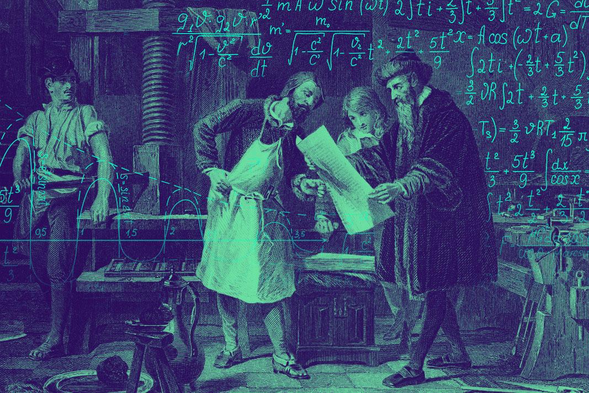

# **Print!** 🖨️

## A simple printing calculator in Vue.js ✌🏻
### Get the size of your image from pixels to cm and vice versa before printing.

Has your image enough pixels for a proper print? Let's calculate the size it will need to look amazing.

👉 Just select the type of print:
- High definition: photo or magazine  300dpi
- Press quality: newspaper or fanzine -> 150dpi
- Home printing: 96dpi 

🖼️ Then, drag and drop your file (JPG, PNG, TIF...).

💁 Here you are. Your final size according to the selected resolution. You can adjust after the measures and resolution if you want to tune your printing.

Try it in: 
<a href="https://pabslow.github.io/print-me/">🖨 Print Calculator - Px to cm converter</a>

